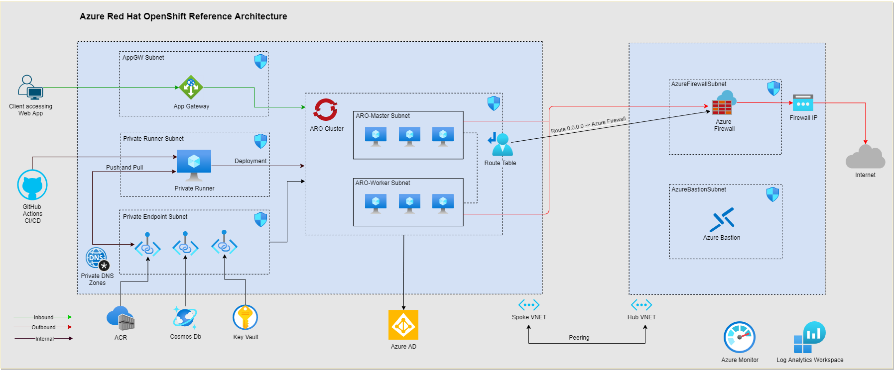

# ARO Reference Architecture

This repo is for building Azure Red Hat OpenShift reference archtiecture and to integrate with other Azure Service

Currently we’ve no reference architectures in Azure Architecture Center for deploying Azure Red Hat OpenShift (ARO) and integrating with various Azure Services. This is been a  pain point for customers looking to deploy ARO following Microsoft recommended best practices and continue to hinder ARO adoption.

Goal of this hackathon project is to come up with Reference Architecture/Reference Implementation to deploy following services:

- Private ARO cluster deployed across AZs
- Integrate with Azure AD for RBAC
- Application Gateway + WAF for ingress/firewall
- Azure Firewall for securing outbound traffic
- Azure Container Registry for storing container images in geo-replicated way
- Azure Key Vault for storing secretes/certificates in a centralized manner
- Azure Monitor/Container Insights for collecting logs in a centralized way
- GitHub Actions for CI/CD
- Azure Database for PostgreSQL with private endpoint for application backend
